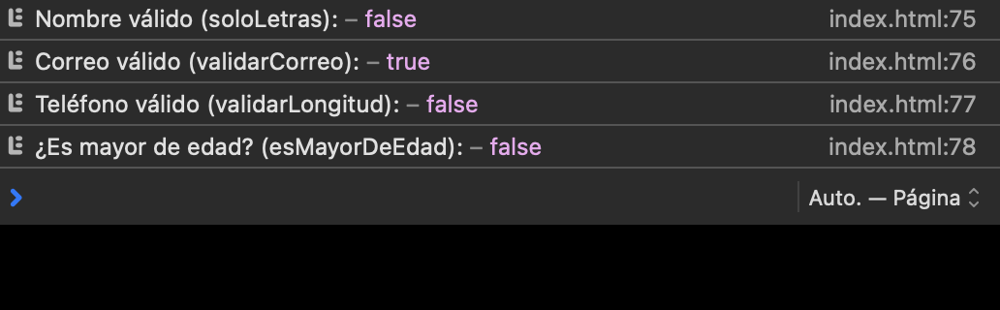
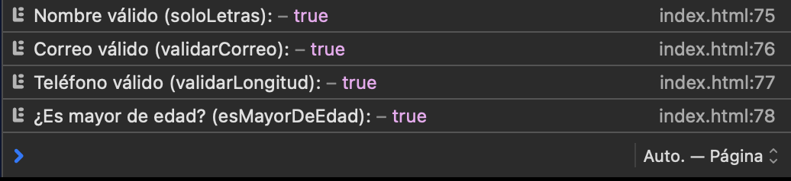
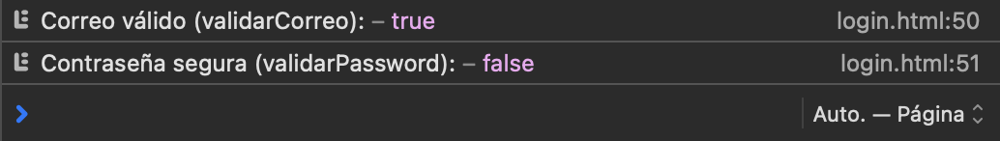
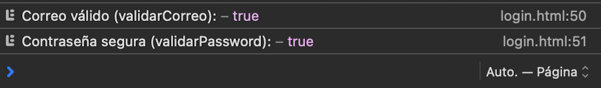
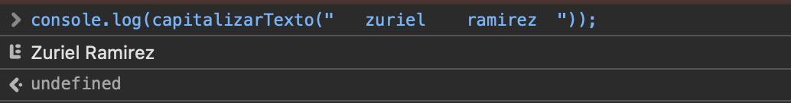
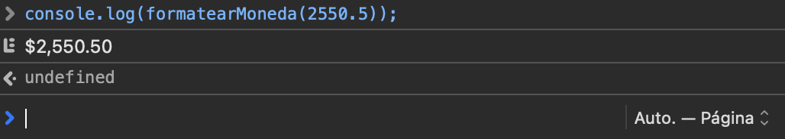

#  Utilería de Validaciones y Formateo en JavaScript

## Autor
** Amisadai Zuriel Bautista Ramírez**

---

# Problema que resuelve

Esta librería proporciona un conjunto de funciones reutilizables para validar información ingresada por el usuario y realizar formateo de datos de manera sencilla.

Su objetivo es reducir la cantidad de código repetitivo en aplicaciones web y facilitar tareas comunes como:

- ✅ Validar correos electrónicos.
- ✅ Verificar la longitud de un teléfono.
- ✅ Permitir únicamente letras en nombres.
- ✅ Validar contraseñas seguras.
- ✅ Calcular la edad de una persona.
- ✅ Determinar si un usuario es mayor de edad.
- ✅ Capitalizar textos automáticamente.
- ✅ Formatear cantidades de dinero en pesos mexicanos.

---

# Instalación

Descarga el archivo **utileria.js** y colócalo dentro de tu proyecto.

Después importa la librería antes de cerrar la etiqueta `<body>`.

```html
<script src="utileria.js"></script>
```

Ahora todas las funciones estarán disponibles para utilizarlas.

---

# Uso

## 1. Validación de correo electrónico

Comprueba que el texto tenga el formato correcto de un correo electrónico.

```javascript
console.log(validarCorreo("correo@dominio.com"));
// true

console.log(validarCorreo("correo-invalido"));
// false
```

---

## 2. Validación de longitud

Permite verificar que un dato tenga exactamente la longitud indicada.

```javascript
console.log(validarLongitud("9511234567",10));
// true

console.log(validarLongitud("9511234567890",10));
// false
```

---

## 3. Solo letras

Valida que un texto contenga únicamente letras y espacios.

```javascript
console.log(soloLetras("Zuriel Ramirez"));
// true

console.log(soloLetras("Zuriel123"));
// false
```

---

## 4. Validación de contraseña segura

Comprueba que la contraseña tenga:

- Mínimo 8 caracteres
- Una letra mayúscula
- Una letra minúscula
- Un número
- Un carácter especial

```javascript
console.log(validarPassword("Temporal.1"));
// true

console.log(validarPassword("12345"));
// false
```

---

## 5. Cálculo de edad y mayoría de edad

Calcula la edad de una persona y verifica si es mayor de edad.

```javascript
console.log(calcularEdad("2000-05-15"));
// Ejemplo: 26

console.log(esMayorDeEdad("2000-05-15"));
// true
```

---

## 6. Capitalizar texto

Elimina espacios innecesarios y convierte el texto a formato de nombre propio.

```javascript
console.log(capitalizarTexto("   zuriel    ramirez  "));
// "Zuriel Ramirez"
```

---

## 7. Formatear moneda

Convierte un número al formato de moneda mexicana (MXN).

```javascript
console.log(formatearMoneda(2550.5));
// "$2,550.50"
```

---

# Capturas de pantalla


Ejemplo:

```
📁 README

imagenes/
│── correo.png
│── telefono.png
│── letras.png
│── password.png
│── edad.png
│── capitalizar.png
└── moneda.png
```

Después insertarlas así:

```markdown
## Error del registro


## Error en la consola



## Registro Correcto


## Consola correcta



## Error en el login


## Error en la consola



## Login correcto


## Consola correcta



## Capitalizar



## Moneda


```

---


# Conclusión

La librería **utileria.js** reúne funciones de validación y formateo que son utilizadas frecuentemente durante el desarrollo de aplicaciones web. Al centralizar estas operaciones en un solo archivo, se mejora la reutilización del código, se disminuyen errores durante la captura de datos y se facilita el mantenimiento de los proyectos. Gracias a su implementación sencilla, puede integrarse fácilmente en cualquier aplicación JavaScript mediante una única referencia al archivo.
